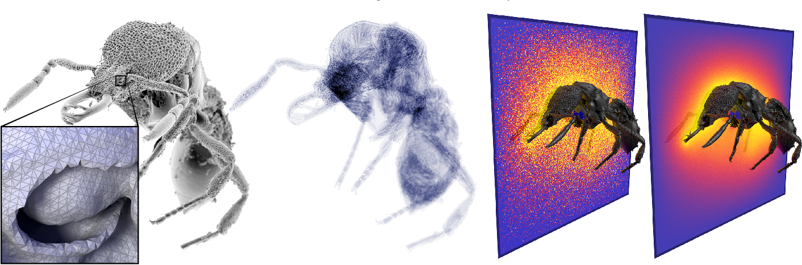
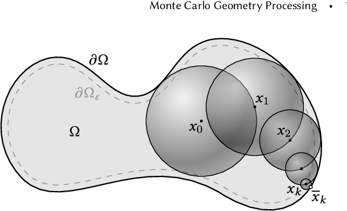
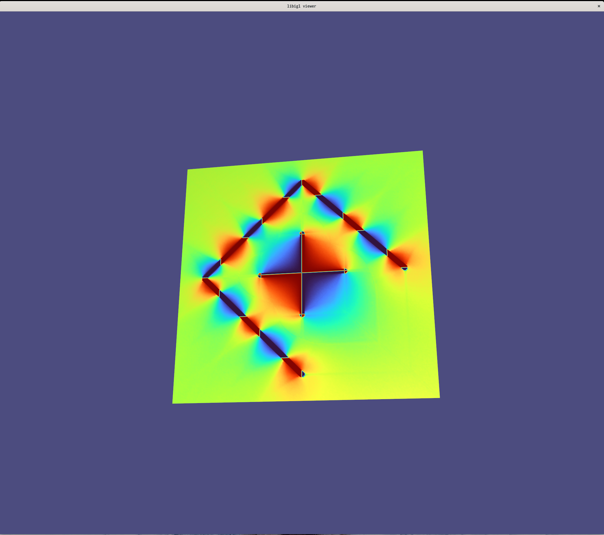
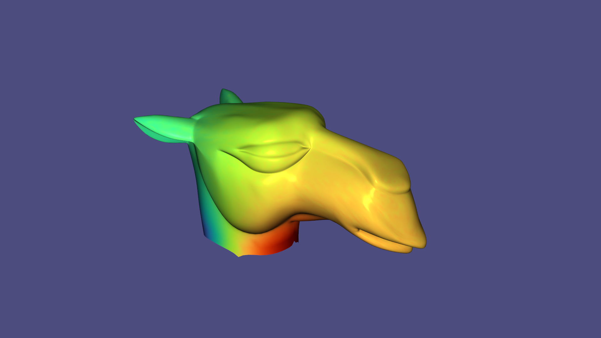

# Monte Carlo Geometry Processing: A Grid-Free Approach to PDE-Based Methods on Volumetric Domains

I implemented a bare-bones version of the core idea from "Monte Carlo Geometry
Processing: A Grid-Free Approach to PDE-Based Methods on Volumetric Domains" by
Sawhney and Crane.
Suppose we want to solve a PDE like the Laplace or Poisson equation on a geometric structure.
Sawhney and Crane’s idea is to avoid meshing challenging geometric structures with finite-element methods (FEM).
FEM can be time-consuming for detailed objects such as the fly on the left (below).
Instead, they use Monte Carlo integration to find an approximate solution.
The Monte Carlo approximation is noisy at first, but can be refined by taking more samples, as shown on the right (below).


(Figure 1 Sawhney & Crane 2020)


## Background

In my implementation I focused on solving the Laplace equation.

$$
\Delta u = 0 \quad\textrm{on}\, \Omega
$$

$$
u = g\quad\textrm{on}\, \partial\Omega
$$

To solve the Laplace equation, Sawhney and Crane use a technique called "walk on spheres".
The idea uses the fact that the solution of a harmonic function at point p is
the expected value of the first point on the boundary reached by a random walk
starting at p.
By symmetry, we can find this boundary point by sampling uniformly on spheres.
We start at x0, then successively sample boundary point until we get to `x_k`,
which is within some threshold $\partial\Omega_\epsilon$ of the boundary (illustrated below).


(Figure 3 Sawhney & Crane 2020)


## Code

I implemented two versions of walk on spheres: a 2D version `walk_on_circles` and a 3D version `walk_on_spheres`.
I put their respective implementations in `walk_on_circles.h/cpp` and `walk_on_spheres.h/cpp`.
Install the code with cmake as usual.
Then, run the `walk_on_circles` code from `main.cpp` with the command line

```
./monte-carlo-geometry-processing --nvertices 256 --max-steps 16 --num-walks 8
```



`nvertices` controls the number of vertices in the planar mesh, `max-steps` is
the maximum number of walk on circles steps, and `num-walks` is the number of
walks on circles per vertex.

Run the `walk_on_spheres` code from `main.cpp` with the command line

```
./monte-carlo-geometry-processing --num-walks 8 --use-camel
```



The difference between the 2D "walk on circles" example and the 3D "walk on spheres" example is the domain.
For walk on circles, the domain is a plane and the boundary conditions are line
segments on the plane with alternating values.
For walk on spheres, the domain is a camel head.
The boundary is the boundary of the camel head, with boundary values equal to
the Z coordinate of the boundary vertices.

When the program is running, press "1" to take more samples.
This updates a cumulative moving average of the Laplace equation solution estimate.
Press "2" to reset and start from `num-walks` samples.
